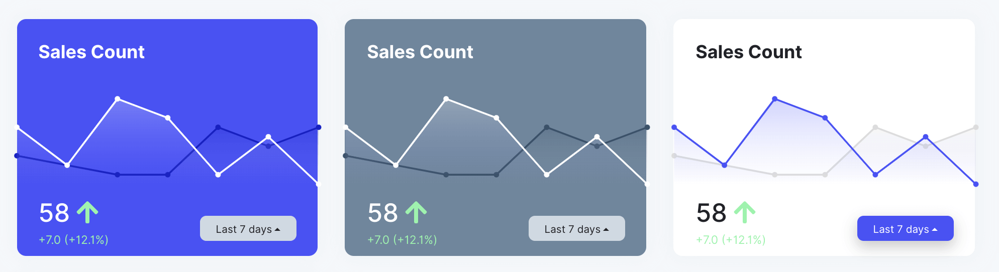

# Charts

[[toc]]

Charts give the user an overview of what is going on on his site or in his application. Charts show Model data and can be displayed on dashboards, index pages as well as on detail pages.

## Create via Artisan

Each chart has its own config file. The artisan command `fjord:chart {name}` generates the chart config into `./fjord/app/Config/Charts`.

```shell
php artisan fjord:chart SalesCountChart --area
```

When no type is given as a flag the default chart type `area` will be generated. Possible flags:

-   `--area`
-   `--bar`
-   `--donut`
-   `--number`
-   `--progress`

The command `fjord:chart` creates a chart config in `./fjord/app/Config/Charts`.

## Configure

Next your chart needs to be configured. Every chart type needs its corresponding Model class and a title.

```php
use App\Models\Sale;

public $model = Sale::class;

public function title()
{
    return 'Sales Count';
}
```

Additionally, each chart type needs a specific configuration, which are linked below:

-   [Area Chart](/docs/charts/area)
-   [Bar Chart](/docs/charts/bar)
-   [Donut Chart](/docs/charts/donut)
-   [Number Chart](/docs/charts/number)
-   [Progress](/docs/charts/progress)

## Register Charts

Charts can be registered on pages that extend the `Fjord\Page\Page` class. For example: `CrudShow` and `CrudIndex`.

```php
use FjordApp\Config\Charts\SalesCountChart;

$page->chart(SalesCountChart::class);
```

:::tip
Use a [form](docs/crud/forms) as a dashboard by only displaying charts on it.
:::

### Customize Card

Each chart is displayed in a card. You may customize them to your needs.

#### Variant

You may display the card in 3 different variants: `primary`, `secondary`, `white`

```php
use FjordApp\Config\Charts\SalesCountChart;

$container->chart(SalesCountChart::class)->variant('primary');
$container->chart(SalesCountChart::class)->variant('secondary');
$container->chart(SalesCountChart::class)->variant('white');
```



#### Width

The width of the chart is indicated by `width`.

```php
use FjordApp\Config\Charts\SalesCountChart;

$container->chart(SalesCountChart::class)->width(1 / 3);
```

#### Height

The height of the chart is indicated by `width`.

```php
use FjordApp\Config\Charts\SalesCountChart;

$container->chart(SalesCountChart::class)->width(1 / 3);
```

## Number Formatting

In the `mount` method the chart can be configured. You can set **format**, **prefixes**, **suffixes** and **currencies**.

```php
public function mount(Chart $chart)
{
    $chart->format('0,0')->prefix('$ ')->suffix(' cm');

    // The currency method adds the needed format and suffix:
    $chart->currency('€');
}
```
