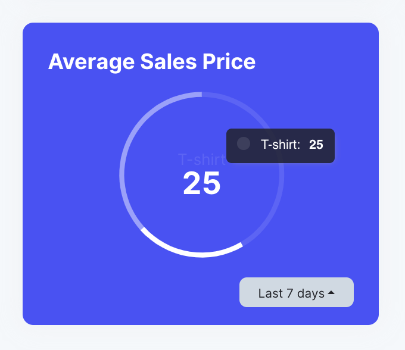

# DonutChart

<center>
  
</center>

A donut chart is generated by adding the `--donut` flag to the artisan command `fjord:chart {name}`.

```shell
php artisan fjord:chart SalesProductsChart --donut
```

## Configuration

Which data is displayed in your chart is configured in the `value` method as shown below. Unlike other chart types, an array with the desired data must be returned.

```php
public function value($query)
{
    return [
        $this->count((clone $query)->where('product', 't-shirt')),
        $this->count((clone $query)->where('product', 't-shirt')),
    ];
}
```

Possible methods:

```php
return $this->count($query);
return $this->average($query, 'price');
return $this->min($query, 'price');
return $this->max($query, 'price');
return $this->sum($query, 'price');
```

For each array item that is returned in the value method, a label must be specified in the `labels` method:

```php
public function labels(): array
{
    return [
        'T-shirt',
        'Jacket',
    ];
}
```
