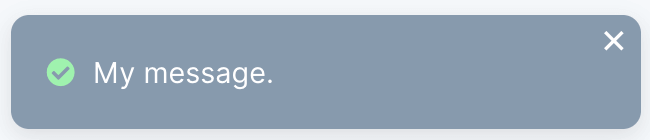
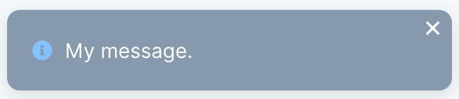
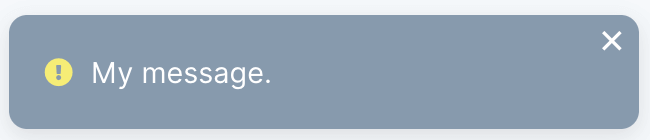
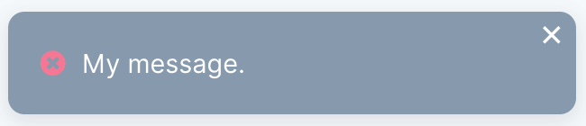
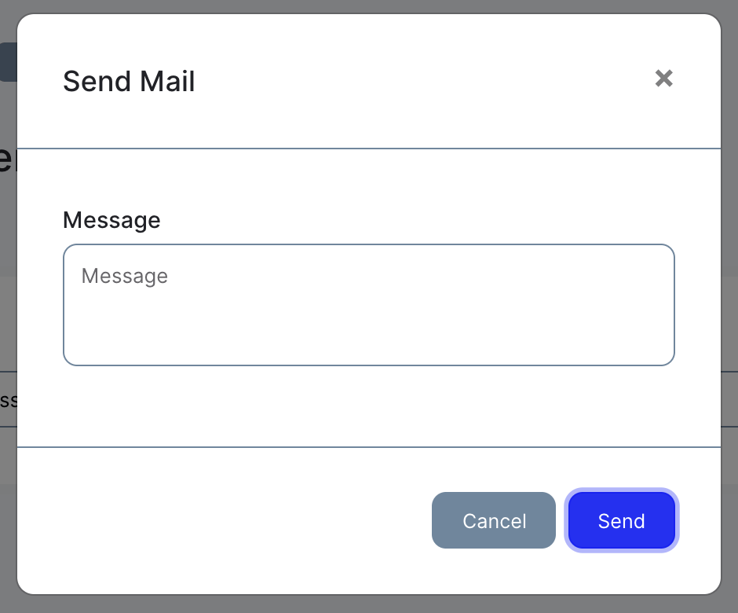

# Actions

[[toc]]

Actions are a useful feature to create reusable tasks for models. These can then be inserted at the desired position, in your index table or on a detail page of a model.

## Create

Actions can be created via artisan.

```shell
php artisan fjord:action MyAction
```

These then end up in the folder `./fjord/app/Actions`.

```php
namespace FjordApp\Actions;

use Illuminate\Support\Collection;

class MyAction
{
    public function run(Collection $models)
    {
        // Do Something.
    }
}
```

## Responses

When a `message` is returned via a json response, a toast is displayed in the lower right corner of the page containing the message. This can be displayed in four variants: `success`, `info`, `warning`, `danger`. The default is `success`.

```php
public function run(Collection $models)
{
    return response()->json(['message' => 'Hello there!', 'variant' => 'info']);
}
```

There is a helper for each vairant:

```php
return response()->success('My message.');
return response()->info('My message.');
return response()->warning('My message.');
return response()->danger('My message.');
```

<center>
  
  
  
  
</center>

## Redirects

If you want to redirect to another page after you have performed your action, you can return one of the Laravel helpers for [redirects](https://laravel.com/docs/7.x/redirects).

```php
public function run(Collection $models)
{
    // Do Something.

    return redirect('your/redirect/url');
}
```

## Confirm Modal

If your action has the function modal, the execution of the action must be confirmed via a modal.

```php
namespace FjordApp\Actions;

use Illuminate\Support\Collection;
use Fjord\Page\Actions\ActionModal;

class MyAction
{
    public function modal(ActionModal $modal)
    {
        $modal->confirmVariant('primary')
            ->confirmText('Run')
            ->message('Do you want to run the Action?');
    }

    public function run(Collection $models)
    {
        // Do Something.
    }
}
```

## Fields

Form fields can be added to the confirm modal of an action. The values of these fields are passed to the action. This allows you, for example, to let the user type in a message to be sent by mail, as shown the following example.

```php
use Illuminate\Support\Collection;
use Fjord\Page\Actions\ActionModal;
use Fjord\Page\Actions\AttributeBag;

public function modal(ActionModal $modal)
{
    $modal->form(function($form) {
        $form->text('message')->title('Message');
    });
}

public function run(Collection $models, AttributeBag $attributes)
{
    foreach($models as $model) {
        Mail::to($model)->send(new ExampleEmail($attributes->message));
    }
}
```

<center>
  
</center>

## Display

Actions can be added to a table using the action method. To do this, the title and namespace of the action must be specified as parameters.

```php
// CrudConfig

use FjordApp\Actions\MyAction;

public function index(CrudIndex $page)
{
    $page->table(...)
        ->action('My Action', MyAction::class);
}
```

Actions can also be displayed on the show page of a crud, even in the slots `navigationLeft`, `navigationRight`, `navigationControls`, `headerLeft` and `headerRight`:


```php
// CrudConfig

use FjordApp\Actions\MyAction;

public function show(CrudShow $page)
{
    $page->navigationLeft()->action('My Action', MyAction::class);
    $page->navigationRight()->action('My Action', MyAction::class);
    $page->navigationControls()->action('My Action', MyAction::class);
    $page->headerLeft()->action('My Action', MyAction::class);
    $page->headerRight()->action('My Action', MyAction::class);
}
```

The `variant` of the actions that are displayed as buttons can be adjusted:

```php
$page->headerLeft()->action('My Action', MyAction::class)->variant('outline-primary');
```
